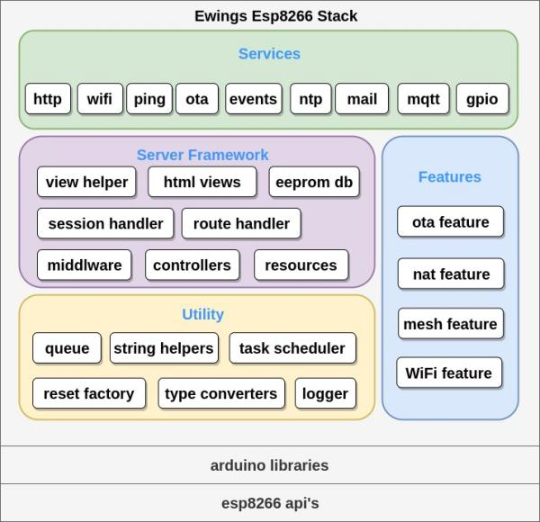
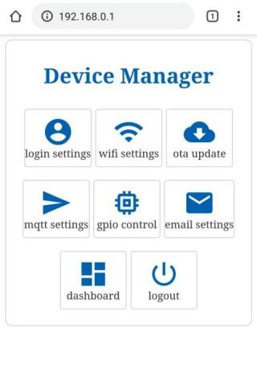

# EwingsEsp8266Stack

Ewings Framework is cover all essential things to build ESP8266 IoT applications easily.
Basically it is designed on the top of arduino-esp8266 layer to make things easy to understand for developers.

**Ewings Esp8266 Framework Structure**

ESP8266 Wi-Fi SoC offers a complete and self-contained Wi-Fi networking solution. When the ESP8266 hosts application, it boots up directly from an external flash.
It has an integrated cache to improve the performance of system’s running applications.

ESP8266EX also integrates an enhanced version of Tensilica’s L106 Diamond series 32-bit processor, with on-chip SRAM, on top of its Wi-Fi functionalities.
It is integrated with external sensors and other application specific devices through its GPIOs. Codes for such applications are provided as examples in the SDK.

The non-OS SDK provides a set of application programming interfaces (APIs) for core ESP8266 functionalities such as data reception/transmission over Wi-Fi, TCP/IP stack functions, hardware interface functions and basic system management functions.
Thus, the SDK APIs allow programmers to focus on the application under development at a higher level. Users can access all core capabilities of ESP8266 without studying its chip architecture in detail.

Arduino has provided user-friendly libraries that use these SDK APIs at bottom. Since arduino has made its easy iot development environment impact over developers, it's easy for them to develop applications with Arduino ide.

Ewings framework sits on the top of these Arduino libraries. So the whole structure looks as shown in the above figure of Ewings Esp8266 Structure.

## Installation

**install from arduino ide**
Goto Tools->Manage Libraries... then in library manager window type esp8266-framework in search bar then from results find esp8266-framework by Suraj I.and click on install.

**install manually**
To install manually clone or download source, copy folder to esp8266 libraries path ( in windows 10 generally path is like ==> C:\Users\suraj\AppData\Local\Arduino15\packages\esp8266\hardware\esp8266\2.6.2\libraries...).

## Usage

Restart the arduino ide and navigate to File->Examples->esp8266-framework->EwStack example compile and upload.

**Note** that installed version of esp8266 should be > 2.6.x. 2.6.2 or greater is recommended. you can check your installed esp8266 version in tools->boards->board manager (type "esp" in top search bar).

**for now** : if you are uploading it first time in device then wait for 5 seconds(default station connect timeout on start) and then press flash key on nodemcu board for upto 6-7 seconds to load first default settings. device will get reset to default settings and restart.

* after initializing device completely, check in pc/mobile wifi list if **esp8266Stack** name appear.
* select it and enter default password **espStack@8266**.
* finally after succesful connectinon to device open browser, type **192.168.0.1** in address bar and press enter
* you will directed to login screen, enter default username and password **( username: esp8266Stack, password: espStack@8266 )**
* now you will able to see below menu options

you can play with all settings. you can modify configs by making changes in files of src/config folder. Go to wifi settings and change the default station ssid, password to connect to your station. you can also change ssid and password for access point. device will reset once after you submit wifi settings, i.e. you have to reconnect device.

**Note** that by default session will active for 300 seconds once login, you can change its timeout in server config file.

## Services

Ewings provides some basic services that required to develop simple iot application. All services are available globally to each other. The services are

* **HTTP Service:**
The application can use this rest API service to make HTTP requests such as get, post, etc. this service is just extended version of arduino http client for esp8266.

* **NTP Service:**
This service provides network time to the application.

* **MQTT Service:**
This lightweight messaging protocol can be used to monitor or operate device itself or sensors that are connected to the device.
To configure and test MQTT go on device local server and select MQTT section under main menu.

* **Event Service:**
This service is introduced to handle specific event tasks that should be executed on event arrival. just register the event listener as task to perticular event and fire it when event happens.

* **OTA Service:**
Over The Air (OTA) feature has ability to update the device firmware remotely. By default OTA configurations are accessible with local server. OTA service is uses firmware version to decide whether start to update or not. OTA server can be set in OTA configuration which is accesible through local server.

    we need to set below route at server

    GET route format as ==> http://server.com/ota?mac_id=xx:xx:xx:xx:xx:xx&version=2019041100 --// this link is called by device on every x seconds provided in OTA configuration with its mac_id and current version ( available in global configuration ) as parameters. Response should be in json as ==> { latest : 2019041101 } which returns latest firmware version available on server

    by default update start only if device current firmware version is older than received firmware version from server.

    when device start the update process after knowing its current firmware version is older it looks for the downloadable file from the same server in format given below

    server address / bin / device mac address / latest firmware version .bin file
    e.g. http://server.com/bin/xx:xx:xx:xx:xx:xx/2019041101.bin

* **ESPNOW Service:**
This service is extended version of ESPNOW feature available in esp8266 with some easy to use api. with help of this feature we can build mesh networking, broadcasting etc n/w as per requirements. this service is not configurable from server for now. but you can manage it with easily available api of this service.

* **WiFi Service:**
This is extended version of arduino wifi library. this service provides simplified api's to dynamically interact with wifi devices on practical field. it has internet based connection ability over same network configs devices which are usefull in mesh scenarios. it also has ability to enable dynamic subnetting heiraechy where each individual device sits in different network and knows how far (in hop distance manner) he is from main hub centre.

* **PING Service:**
As name suggest this service extends basic ping feature of esp8266 sdk api. this service is utilized in wifi service to check active internet.

* **GPIO Service:**
GPIOs are actually going to interact with sensors. We can read sensor or we can drive appliances with the help of this GPIO services.

* **MAIL Service:**
MAIL service is uses SMTP driver to connect and send mail to any account. you should have a SMTP server account credentials that device uses to send mail. to set configuration goto local server and select Email section under main menu.
you can test it with tick option provided in email section before submit configuration form. the best demo way to test this section is create free mailtrap account where we get configurations.
this service should be enabled from common configuration file wherever this service act as dependency service. for example GPIO alert system has alert channel of email. GPIO alerts generated on user selected alert channel.

* **GPIO Alerts:**
GPIO alerts are provided to get notified on specific condition met. from local server GPIO alert conditions can be set in GPIO alert section which is available under GPIO manage section.

## Ewings Local Server

Esp8266 has built in WiFi feature that work in both station as well as access point mode. Station mode is mode using which we can connect to other wifi network. Access point mode is mode using which Esp8266 create its own network. Ewings stack comes with a local http server facility using access point mode of esp8266. By default this server has setting, monitor pages added.

Ewings Server Framework has following components

* **Controllers :**
Controllers used to handle request from client. collecting user inputs, processing, building response for requests etc. works can be carried out in this component.

* **Middlewares :**
Middlewares used to provide filter like component for all requests. by default only auth middlware checks every request for its session. middlware needs to be assigned to route while registering them in controller.

* **Session Handler :**
Session handler takes care of login sessions. By default, login session expire after 5 minutes.

* **Route Handler :**
This handles routing operations of the server. It registers a specific controllers method to URL with facility of authentication through middlware.

* **EEPROM Database :**
Esp8266 has software eeprom library that actually uses space in flash memory to store Ewings framework related config data. Server uses this database to fetch and view settings and control panel of device.

* **View Helpers :**
These helpers help to dynamically creates html tags.

* **Views :**
These are static html pages that split into header, middle and footer sections. At the time of sending http response we gathers them to form a complete html page.

* **Web Resources :**
These are required resources to server framework components.

## Features

Esp8266 has many built in features that will be useful in network applications. Those features are added with Ewings Framework structure.

* **NAT :**
Network address translation (NAT) is a method of remapping one IP address space into another by modifying network address information in the IP header of packets while they are in transit across a traffic routing device. With this feature we can extend station network ( network that has active internet ) range.

    from v2.6.^ arduino has provided initial support example of NAT with lwip v2 variant.

    before that lwip 1.4 is used to enable napt ( network address & port transform ) feature but with some customizations in lwip1.4. you can test it just rename ".....esp8266/tools/sdk/lwip" with ".....esp8266/tools/sdk/lwip.org" and copy lwip folder ( in this repo ) there. do not forget to select lwip 1.4 compile from source variant in arduino tools option while building also make required changes in config/Common.h file regarding lwip feature.

    By default this feature is active.

* **MESH :**
This feature easily possible with esp8266 esponow feature. Ewings stack provided basic espnow service to make this available in application where mesh network is required. The basic motive to bring this feature is connectivity.

## Utilities

This common section is made to support/help all other section in their operations. This section consists of some most vital libraries that enable services to run in background/periodically. This section is the base for all other section hence all other services are dependent on this section.

* **Queue :**
Queue is dynamic service which enables users to push any data in it and pop it later for use.

* **String Helpers :**
String Helpers helps the user in many string related operations like finding, replacing, JSON parsing, etc.

* **Scheduler :**
Scheduler enables the feature of scheduling many things that executes later once or every time on specific intervals/timeouts. Scheduler also accepts priority as parameter for task, where by default big number is kept as big priority.

* **Reset Factory :**
This helps to reset the whole device to its default settings in case of device malfunctioning badly. By pressing flash key on device for about 6-7 seconds this service resets all settings to its default one. also this service accept task which should be run while reset factory executing.

* **Data Type Converters :**
As name clears the purpose of this utility. It just used to convert the data types from one to another like integer to string and vice versa.

* **Logger :**
Logger enables log on uart0 pins at 115200 baud rate. This is useful in case of debugging application flow.
